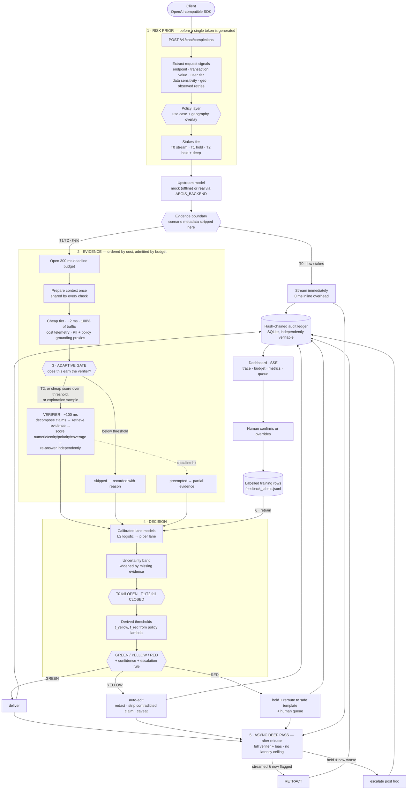

# AEGIS

**A model-agnostic reverse-proxy gateway that decides, per LLM response, how much scrutiny it
deserves and what happens next.**

Accenture Innovation Challenge 2026 — Round 2, Track 1 (ControlPlane.ai)

```bash
make demo
```

That is the whole quickstart. It builds a virtualenv from pinned dependencies, fits the calibrated
lane models from the labelled corpus, starts the gateway, replays <!--m:scenarios-->21<!--/m--> labelled scenarios plus 36
benign background requests, verifies the audit ledger with a standalone tool, and leaves the
dashboard at <http://127.0.0.1:8000>. It runs entirely offline — no API key, no network, no Docker.

---

## Submission links

| | |
|---|---|
| **Demo video (4:44)** | <https://drive.google.com/file/d/1YZuDMAda0qflqeJNDB1kYrpFdGVIGQd1/view?usp=sharing> |
| **Business proposal deck** | [`docs/AEGIS_R2_Business_Proposal.pptx`](docs/AEGIS_R2_Business_Proposal.pptx) — 14 slides, on the Round 1 template |
| **Public repository** | <https://github.com/adityadeshmukh23/accenture-innovation-challenge-2026> |

The video walks the seeded RED case being flagged, held and rerouted live on the dashboard, the
300 ms budget being enforced and missed, the metrics view, and the ledger tamper proof.

---

## Contents

- [Submission links](#submission-links)
- [What problem this solves](#what-problem-this-solves)
- [Architecture](#architecture)
- [The two tradeoffs everything else follows from](#the-two-tradeoffs-everything-else-follows-from)
- [Implementation approach](#implementation-approach)
- [LLM vs deterministic: what each check actually uses](#llm-vs-deterministic-what-each-check-actually-uses)
- [Use cases](#use-cases)
- [Dependencies](#dependencies)
- [Execution instructions](#execution-instructions)
- [Metrics and how to read them](#metrics-and-how-to-read-them)
- [Requirements mapping](#requirements-mapping)
- [Assumptions](#assumptions)
- [Limitations and what production would add](#limitations-and-what-production-would-add)

---

## What problem this solves

An LLM in production fails in three ways that need different responses, and a single guardrail
cannot serve all three:

| Lane | Failure | Why a uniform check fails |
|---|---|---|
| **Performance** | confidently wrong, ungrounded, hallucinated | catching it needs a second model pass — too expensive to run on everything |
| **Cost** | retry storms, token spikes, latency drift | catching it is nearly free, but only against a learned baseline |
| **Responsibility** | PII exposure, unsafe advice, bias | some of it must be inline (redaction), some is too slow (bias) |

AEGIS sits in front of the model as an OpenAI-compatible proxy and, for every response, decides
**how much scrutiny it has earned** and **what happens to it**: `GREEN` deliver, `YELLOW` auto-edit,
`RED` hold and escalate — each with a calibrated confidence and an explicit human-in-the-loop rule.

The point is not that it flags things. The point is that **it correctly leaves good responses
alone**, and that every flag shows its work.

---

## Architecture



**The ordering is the design.** The prior runs before generation because it decides the latency
posture. The cheap checks run before the verifier because they decide whether the verifier is worth
paying for. The verifier runs under a deadline because a check that overruns its budget has failed,
not succeeded.

---

## The two tradeoffs everything else follows from

### Latency budget vs scrutiny depth

A real verifier costs more than the entire budget on a large document. Three mechanisms resolve
that, and none of them is "check less and hope":

**1 · Anytime verification under a deadline.** Checks are admitted only if the budget can afford
them, priced by a *parametric* cost model — the verifier's cost is dominated by document size
(`a·sentences + b·sentences·claims`), so a flat average learned on short documents under-prices a
5,000-clause contract by two orders of magnitude. A **preemptible** check is admitted even when it
certainly cannot finish, because partial evidence beats no evidence; a non-preemptible one is not,
because starting what you cannot finish spends the budget and returns nothing.

**2 · Missing evidence is never silent — and it has exactly one meaning.**

> **If the verifier ran out of budget, it couldn't check. If no context was supplied, it also
> couldn't check. Both produce missing evidence; the tier decides which way the uncertainty band
> falls.**

Both leave every Performance feature at zero, and a lane whose features are all zero reports its
base rate — which is *not* a low-risk finding, it is an absence of any finding. So both widen the
uncertainty band in proportion to what was not learned, and then the tier decides direction:
**T0 fails open** (deliver, audit async, retract if wrong), **T1/T2 fail closed** (escalate).

*Cause one — the budget.* `budget_miss_01` and `budget_miss_open_01` are the same policy, the same
5,000-clause document and the same overrun, differing only in the request signals, which put one at
T1 and the other at T0. Both start the verifier and both blow the 300 ms deadline at 0 claims
checked. The T1 request escalates to **RED** on the strength of *not having been able to check*; the
T0 request is **delivered un-audited** and flagged asynchronously.

*Cause two — no grounding context.* A request with no documents attached is not a verified request,
it is an **unverifiable** one. A $500,000 fintech question with an empty context and a wholly
invented answer takes the identical path: band widened to ±0.35, `p_high` 0.398 against a RED cut
point of 0.211, **RED** and escalated to a human. At T0 the same request is delivered and audited
asynchronously.

**Only hallucination detection degrades without context.** The Cost and Responsibility lanes need no
grounding documents and continue to run in full on ungrounded traffic — token and retry telemetry,
PII detection with Luhn validation, policy patterns and the async bias pass all still fire. What is
lost is the ability to check a claim against a source, and that loss is declared rather than
absorbed.

**3 · Adaptive scrutiny.** Cheap deterministic signals run on 100% of traffic at ~2 ms and gate the
~100 ms verifier; a proportional controller nudges the gate toward each policy's target rate. A
seeded **exploration sample** verifies a fraction of *ungated* traffic on purpose: without it, every
estimate of the catch rate is conditioned on the gate having already fired, and the false-negative
rate on ungated traffic is unobservable. ([What it costs and catches](#adaptive-scrutiny).)

### Over-flagging vs under-flagging

**Thresholds are derived, not hand-tuned.** Each lane declares `lambda` = cost(false negative) /
cost(false positive). AEGIS minimises expected loss over the three actions:

```
loss(GREEN)  = p · λ
loss(YELLOW) = p · (1−η) · λ + (1−p) · α
loss(RED)    = (1−p) · 1

t_yellow = α / (α + λ·η)
t_red    = (1−α) / ((1−α) + λ·(1−η))
```

Changing risk appetite means changing one number. The same code gives `fintech_advisor` a RED cut
point of **0.211** and `support_copilot` **0.588** purely because λ is 8.0 versus 1.5. Move the
slider on the dashboard's Policy tab and watch the bands move.

**YELLOW is the load-bearing part.** Forcing a binary choice is what makes both error types
expensive. The middle band gets *cheap hedges* — redact the PII, drop the contradicted sentence,
append a caveat naming the specific uncertainty — which cost little when applied unnecessarily. That
is what lets the RED threshold stay high without abandoning recall. A consequence worth noticing:
because redaction is a highly effective hedge (η = 0.85), `clinical_intake` derives a *higher* RED
threshold than `fintech_advisor` despite a much higher λ. When editing genuinely works, you edit
rather than block.

**A lane never flags on its own prior.** If every feature is zero, `p` equals the model's base rate
and there is no evidence to act on. A high cost-of-miss is an argument for acting on *weak*
evidence; it is not an argument for acting on *no* evidence. (This was a real bug: a clean clinical
summary with every feature at zero scored 0.0285 against a 0.023 threshold and was being auto-edited
on the strength of nothing.)

**The feedback endpoint is a poisoning surface, and is guarded as one.** Two guards, addressing two
different things:

* **Rate limit** — a sliding window per operator and globally (`AEGIS_OVERRIDE_LIMIT`, default 10 per
  10 minutes). Blunt, and the reason the endpoint is no longer unbounded.
* **Protected detections** — some findings are not statistical opinions. A card number that passes a
  Luhn checksum, a US SSN pattern, an explicit dosage instruction, a regulatory guarantee phrase:
  these are facts about the text. An override contradicting one is **honoured and audited** — it
  still changes that response's outcome, because a human's judgement is not overruled by the
  machine — but it is **withheld from training**, with the reason recorded in the ledger.

That boundary is the design: *operators keep authority over releases; the detectors keep authority
over arithmetic.* Verified live — eight sequential overrides of an SSN-plus-card RED now leave
`pii_severity` and `pii_count` bit-identical and the decision still RED, while a legitimate override
of the `fin_overflag_01` false positive still trains normally.

The endpoint remains **unauthenticated** in this build. That is a demo affordance, not a design
position; production needs operator identity before any of this is load-bearing.

**Calibration is measured, not assumed.** The derived thresholds are only meaningful if `p` is a
real probability, so the fit reports Brier and ECE, and **class balancing is deliberately off** —
inverse-frequency weights improve recall by dragging the learned base rate toward 0.5, which
decalibrates `p` and silently corrupts every threshold in the system. λ already encodes the
asymmetry, once.

---

## Implementation approach

| Stage | Module | What it does |
|---|---|---|
| Risk prior | `aegis/risk/` | request signals → stakes score → tier → latency posture |
| Policy | `aegis/decision/policy.py` | YAML policies, geography overlays, threshold derivation |
| Budget | `aegis/gateway/budget.py` | deadline, parametric cost model, admission, preemption |
| Evidence | `aegis/evidence/` | verifier, cost telemetry, PII/policy/bias |
| Fusion | `aegis/decision/fusion.py` | L2 logistic per lane, uncertainty band, confidence |
| Adaptive | `aegis/adaptive/scheduler.py` | cheap-signal gate + rate controller + exploration |
| Actions | `aegis/decision/actions.py` | redact, strip contradicted claims, caveat, reroute |
| Audit | `aegis/audit/ledger.py` | hash-chained SQLite ledger |
| Feedback | `aegis/feedback/` | labelled rows from human verdicts, regularised refit |
| Dashboard | `aegis/dashboard/` | vanilla JS + SSE, no build step |

### How the verifier actually works

1. **Decompose** the response into individually checkable claims (sentence split, conversational
   filler dropped; a sentence qualifies if it carries a figure or a named entity, *regardless of how
   few content words survive stopword filtering* — a bare count silently dropped `"The ratio is
   0.68%."`, exactly the kind of terse assertion that most needs checking).
2. **Retrieve** the best-matching context span per claim via an IDF-weighted vector index.
3. **Score agreement on four independent axes**, each producing a human-readable reason:
   - *numeric* — same-unit comparison with a 2% tolerance (`68 bps` normalises to `0.68%`);
   - *entity* — proper nouns present in the claim but absent from the whole context;
   - *polarity* — negation-cue parity between claim and evidence;
   - *coverage* — IDF-weighted term overlap.
4. **Re-answer** the question extractively from the context — top-*k*, never top-1, because a
   multi-part question is not answerable from one sentence and scoring against one manufactures
   false mismatches — then compare the answer slot against the model's.

Every intermediate lands in a `VerifierTrace` that the dashboard renders claim by claim. **A flag
with no visible trace is a black box.**

An **abstention** ("the document does not state that") is detected explicitly and scores zero
disagreement. Punishing an honest refusal would create pressure toward confabulation — the model
would learn that declining to answer scores worse than inventing one.

---

## LLM vs deterministic: what each check actually uses

This is the honest breakdown. **In the default offline configuration, no neural model runs at all** —
every check is deterministic code. That is a deliberate property, not a shortcut: it makes the demo
reproducible, inspectable, and free, and it means a judge can read exactly why any flag fired.

| Check | Offline default (`AEGIS_BACKEND=mock`) | With `AEGIS_BACKEND=openai` |
|---|---|---|
| Risk prior | **Deterministic** — rules + weighted signals over request metadata | unchanged |
| Claim decomposition | **Deterministic** — sentence segmentation + type classification | unchanged |
| Evidence retrieval | **Deterministic** — IDF-weighted cosine over context sentences | unchanged |
| Numeric / entity / polarity / coverage agreement | **Deterministic** — unit-aware numeric comparison, proper-noun set difference, negation parity, term overlap | unchanged |
| Verifier re-answer | **Deterministic extractive** — top-*k* retrieval from the same context | **LLM call** to `AEGIS_VERIFIER_MODEL`, prompted to answer only from the documents |
| Cost telemetry | **Deterministic** — EWMA baselines, z-scores with a 2σ deadband, retry fingerprinting | unchanged |
| PII detection | **Deterministic** — regex + **Luhn checksum** for card numbers | unchanged |
| Policy / guarantee / dosage patterns | **Deterministic** — pattern sets, disclaimer-aware suppression | unchanged |
| Bias pass | **Deterministic** — demographic × evaluative co-occurrence, prescriptive-stereotype patterns | unchanged |
| Lane probability | **Learned** — L2-regularised logistic regression fitted from the labelled corpus | unchanged |
| Threshold selection | **Derived** — closed-form from policy λ, α, η | unchanged |
| Upstream response | **Deterministic mock** (or a scenario-pinned fixture) | real provider |

The one **learned** component is the per-lane logistic model — ~30 lines of NumPy, trained by
`make fit` from features extracted by running the real checks over the corpus. There are no
hand-written feature values anywhere: change the verifier and the training data changes with it.

### Why you can trust the seeded scenarios

A scenario may pin what the **upstream model returns** — that is a recorded fixture, exactly what any
reproducible eval does. What a scenario can never do is tell AEGIS what to *conclude*. The pipeline
strips all scenario metadata at the evidence boundary, and `CheckInput` structurally cannot carry a
`scenario_id` or a `ground_truth`.

`tests/test_no_leakage.py` proves it behaviourally: the same request and response are submitted
three times with *contradictory* labels attached, and the verdict must be identical every time.

---

## Use cases

Four use cases, one code path, four YAML files.

| Use case | Stakes driver | Posture | Dominant lane | λ (perf / cost / resp) | RED behaviour |
|---|---|---|---|---|---|
| `fintech_advisor` | transaction value, client tier | hold ≤300 ms | Performance | 8.0 / 2.0 / 5.0 | reroute to advisor + human |
| `clinical_intake` | PHI sensitivity | hold, never stream | Responsibility | 6.0 / 1.5 / 10.0 | withhold + clinician review |
| `support_copilot` | high volume, low value | **stream + async audit** | Cost | 1.5 / 6.0 / 3.0 | retract + reissue |
| `batch_analytics` | offline | no latency ceiling | all | 4.0 / 0.5 / 4.0 | hold indefinitely |

`policies/overlays/eu_geo.yaml` stacks on **any** of them when a request carries `geo: EU`: it raises
the Responsibility λ from 10 to 12, adds a GDPR hard rule making PII a hard stop with mandatory human
review, and disables streaming entirely. Scenarios `clin_pii_01` and `clin_eu_pii_01` are byte-identical
requests that differ only in geography.

---

## Dependencies

Eight pinned packages, no ML framework, no database server, no JavaScript build chain.

```
fastapi==0.115.6      uvicorn==0.34.0     pydantic==2.10.4    httpx==0.28.1
PyYAML==6.0.2         numpy==2.2.1        pytest==8.3.4       pytest-asyncio==0.25.0
```

Python 3.11+ (developed and tested on 3.12.2, macOS). The audit ledger uses stdlib `sqlite3`; the
dashboard is hand-written HTML/CSS/JS served as static files.

---

## Execution instructions

### Quickstart

```bash
make demo
```

### Individual targets

```bash
make help            # list every target
make run             # gateway + dashboard only
make scenarios       # replay the seeded set against a running gateway, print the scorecard
make fit             # re-fit the lane models from the labelled corpus
make test            # <!--m:test_count-->96<!--/m--> unit + integration tests
make verify-ledger   # independently verify the audit ledger hash chain
make tamper-demo     # prove tamper detection works, on a throwaway copy
make clean           # remove venv, data and caches
```

Run on a different port with `make demo PORT=8010`.

### Sending your own request

```bash
curl -s http://127.0.0.1:8000/v1/chat/completions -H 'content-type: application/json' -d '{
  "model": "aegis-mock-1",
  "messages": [{"role": "user", "content": "What did the fund return in FY2024?"}],
  "aegis": {
    "use_case": "fintech_advisor",
    "transaction_value": 250000,
    "data_sensitivity": "financial",
    "context": "The Meridian Growth Fund returned 4.2% net of fees in FY2024.",
    "mock": {"answer": "The fund returned 7.9% net of fees in FY2024."}
  }
}' | python3 -m json.tool
```

The response is an ordinary OpenAI completion with an added `aegis` block carrying the decision,
confidence, budget readout and reasoning trace. A client that ignores that block still gets a
response with the policy already enforced on its text.

**Free text in that block is redacted by default.** The raw response (`original_text`) and the
verifier's claim strings need `"include_raw_trace": true` — and that opt-in is *overridden* whenever
policy says the content may not leave: RED, edited, rerouted, retracted, or any detected PII.
`trace_redacted` and `trace_redaction_reason` always report which applied. Without this, enforcement
is cosmetic: a `clinical_intake` RED under the EU overlay reroutes the visible answer to a safe
template, and an `original_text` still carrying the MRN and SSN would release, in the same HTTP
response, exactly what the gateway just ruled unreleasable. Redaction is at the **client boundary
only** — the audit ledger and operator dashboard still receive the full text, because an audit trail
that redacts what it is auditing is worthless.

### Using a real model

```bash
export AEGIS_BACKEND=openai
export OPENAI_API_KEY=sk-...
make demo
```

Nothing in the pipeline changes: the gateway still sees `(question, context, response, telemetry)`.
Only the source of the response and of the verifier's re-answer differ.

---

## Metrics and how to read them

Every figure is recomputed by walking the audit ledger — there are no stored counters — so the
dashboard cannot drift from the records that justify it. Reference run (`make demo`, seed 1337).

> **These numbers are generated, not transcribed.** `make demo` writes `data/metrics.json`, and
> `make sync-docs` rewrites every figure below from it. `make test` runs `sync_docs.py --check`, so a
> stale number in this README fails the build rather than surviving to a reader. This exists because
> the previous revision shipped a requirements-mapping row quoting a p95 twenty times lower than the
> latency table below it — both supposedly from the same run.
>
> **Two tiers, because two kinds of figure fail differently.** Everything fixed by the seed —
> per-lane rates, final accuracy, cost, calibration, counts, the test count — must match **exactly**
> on any machine, and `make test` enforces that. **📐 marks the rest: wall-clock latency, and
> anything derived from how much verification your machine finished inside the 300 ms deadline
> (`budget_miss_01` above all).** Those are compared within a tolerance rather than pinned, so a
> faster clone does not fail its own build, and `make demo` prints your machine's values beside
> these.

### Per lane, against seeded ground truth

| Lane | TP | FP | FN | TN | Precision | Recall | F1 | FPR | FNR |
|---|---|---|---|---|---|---|---|---|---|
| performance | <!--m:perf_tp-->11<!--/m--> | <!--m:perf_fp-->1<!--/m--> | <!--m:perf_fn-->0<!--/m--> | <!--m:perf_tn-->9<!--/m--> | <!--m:perf_prec-->0.917<!--/m--> | <!--m:perf_reca-->1.000<!--/m--> | <!--m:perf_f1-->0.957<!--/m--> | <!--m:perf_fpr-->0.100<!--/m--> | <!--m:perf_fnr-->0.000<!--/m--> |
| cost | <!--m:cost_tp-->1<!--/m--> | <!--m:cost_fp-->0<!--/m--> | <!--m:cost_fn-->0<!--/m--> | <!--m:cost_tn-->20<!--/m--> | <!--m:cost_prec-->1.000<!--/m--> | <!--m:cost_reca-->1.000<!--/m--> | <!--m:cost_f1-->1.000<!--/m--> | <!--m:cost_fpr-->0.000<!--/m--> | <!--m:cost_fnr-->0.000<!--/m--> |
| responsibility | <!--m:resp_tp-->6<!--/m--> | <!--m:resp_fp-->0<!--/m--> | <!--m:resp_fn-->0<!--/m--> | <!--m:resp_tn-->15<!--/m--> | <!--m:resp_prec-->1.000<!--/m--> | <!--m:resp_reca-->1.000<!--/m--> | <!--m:resp_f1-->1.000<!--/m--> | <!--m:resp_fpr-->0.000<!--/m--> | <!--m:resp_fnr-->0.000<!--/m--> |

**The single Performance false positive is `fin_overflag_01`, and it is deliberate.** It is a
substantively *correct* answer ("a shade over four percent after charges") expressed in words rather
than figures, so numeric grounding finds nothing to match. It exists so the false-positive rate is
non-zero and honest, and so the λ slider has something real to trade against. A checker that scored
1.000 on everything would mean the corpus was too easy, not that the checker was good.

### What those rates are actually worth

A rate is only as good as the count beneath it, and these counts are small. The 95% Wilson intervals
below are computed from the same confusion matrix by `make sync-docs` — they are generated, not
typed, and drift in them fails the build like every other figure here.

| Lane | Precision | *n* | 95% CI | Recall | *n* | 95% CI |
|---|---|---|---|---|---|---|
| performance | <!--m:perf_prec-->0.917<!--/m--> | <!--m:perf_prec_n-->12<!--/m--> | <!--m:perf_prec_ci-->[0.65, 0.99]<!--/m--> | <!--m:perf_reca-->1.000<!--/m--> | <!--m:perf_reca_n-->11<!--/m--> | <!--m:perf_reca_ci-->[0.74, 1.00]<!--/m--> |
| responsibility | <!--m:resp_prec-->1.000<!--/m--> | <!--m:resp_prec_n-->6<!--/m--> | <!--m:resp_prec_ci-->[0.61, 1.00]<!--/m--> | <!--m:resp_reca-->1.000<!--/m--> | <!--m:resp_reca_n-->6<!--/m--> | <!--m:resp_reca_ci-->[0.61, 1.00]<!--/m--> |
| cost | <!--m:cost_prec-->1.000<!--/m--> | <!--m:cost_prec_n-->1<!--/m--> | <!--m:cost_prec_ci-->[0.21, 1.00]<!--/m--> | <!--m:cost_reca-->1.000<!--/m--> | <!--m:cost_reca_n-->1<!--/m--> | <!--m:cost_reca_ci-->[0.21, 1.00]<!--/m--> |

**The Cost lane is demonstrated on one example, not statistically measured.** Its 1.000 / 1.000 rests
on a single positive — `sup_cost_storm_01` — and an interval of <!--m:cost_prec_ci-->[0.21, 1.00]<!--/m--> carries
essentially no information. Read that row as *"the mechanism fires correctly on the case it was built
for"*, not as a measured detection rate. It is reported at the same precision as the other lanes
because suppressing it would be worse, but it should not be read as comparable evidence.

Performance, at <!--m:perf_prec_n-->12<!--/m--> predicted positives, is the only lane whose rate is
worth quoting on its own — and even it is consistent with a true precision as low as the bottom of
its interval. Responsibility sits between the two. **None of these intervals is narrow enough to
support a claim about production performance**; they bound what a 21-scenario seeded set can
establish, which is a demonstration, not an estimate.

*Wilson rather than the normal approximation, deliberately: at 6/6 and 1/1 the normal interval
collapses to zero width, which would present the smallest samples as the most certain ones.*

### Inline vs final — the latency tradeoff, quantified

| View | Decision accuracy | Performance recall |
|---|---|---|
| **Inline** 📐 (what the user received at request time) | <!--m:acc_inline_pct-->81.0%<!--/m--> (<!--m:acc_inline_frac-->17/21<!--/m-->) | <!--m:perf_recall_inline-->0.727<!--/m--> |
| **Final** (after the async deep pass) | <!--m:acc_final_pct-->95.2%<!--/m--> (<!--m:acc_final_frac-->20/21<!--/m-->) | <!--m:perf_reca-->1.000<!--/m--> |

Reporting only one of these would mislead in opposite directions: inline alone ignores every
retraction the system actually made, final alone takes credit for catches the user never saw in
time. The gap *is* the cost of streaming, stated numerically.

### Latency

| Figure | Value (reference machine) |
|---|---|
| Inline overhead p50 📐 | **<!--m:lat_p50-->2.3<!--/m--> ms** |
| Inline overhead, streamed requests | **0.0 ms** |
| Within their own policy budget 📐 | **<!--m:within_budget_frac-->51/53<!--/m--> (<!--m:within_budget_pct-->96%<!--/m-->)** |
| p95 overhead as % of its own budget 📐 | **<!--m:budget_pct_p95-->1.8%<!--/m-->** |
| Budget exhausted 📐 | <!--m:budget_exhausted_frac-->2/53<!--/m--> — the two seeded budget-miss scenarios |
| Inline overhead p95 (raw ms) 📐 | <!--m:lat_p95-->125.2<!--/m--> ms |

Read these two ways. Overhead is measured against *each request's own* budget — pooling a 300 ms
interactive budget with a 30 s batch one would flatter both — so **p95 as a share of its own budget
(<!--m:budget_pct_p95-->1.8%<!--/m-->)** is the meaningful figure. And the raw p95 is not ordinary
traffic: two of <!--m:held-->53<!--/m--> held requests are deliberately pathological 5,000-clause
budget-miss scenarios, and at that sample size the 95th percentile lands on one. The median,
<!--m:lat_p50-->2.3<!--/m--> ms, is what normal traffic costs.

### Adaptive scrutiny

Verifier ran inline on **<!--m:verif_frac-->17/53<!--/m--> held requests (<!--m:verif_pct-->32%<!--/m-->)** — 100% on
high-stakes policies, **<!--m:support_verif_pct-->5%<!--/m--> on low-stakes support traffic** — while still
reaching <!--m:perf_reca-->1.000<!--/m--> final recall on Performance. That ratio is
the headline efficiency number: it is what makes a 300 ms budget survivable at scale.

### Cost and calibration

Estimated **<!--m:cost_per_request-->$0.00237<!--/m--> per request**, with the verifier accounting for
<!--m:verifier_token_share-->96.4%<!--/m--> of tokens — which is precisely why gating it matters.
Calibration: **Brier <!--m:brier-->0.073<!--/m-->, ECE <!--m:ece-->0.100<!--/m-->** over <!--m:calib_n-->63<!--/m--> lane-decisions.
Per-lane fitted Brier: performance 0.036, cost 0.016, responsibility 0.006.

---

## Requirements mapping

| ControlPlane.ai brief requirement | Where addressed |
|---|---|
| Model-agnostic gateway for LLM traffic | `aegis/api/openai_compat.py`, `aegis/backends/registry.py` — OpenAI-compatible proxy; mock or real upstream via one env var |
| Per-response risk decisioning | `aegis/gateway/pipeline.py` |
| Three risk lanes (performance / cost / responsibility) | `aegis/evidence/{performance,cost,responsibility}.py` |
| Pre-generation risk prior from request-time signals | `aegis/risk/signals.py`, `aegis/risk/prior.py` |
| High-stakes hold-and-release within ~300 ms | `aegis/gateway/budget.py`; see [Latency](#latency) — median overhead <!--m:lat_p50-->2.3<!--/m--> ms, <!--m:within_budget_frac-->51/53<!--/m--> within their own budget |
| Low-stakes streaming + async audit + retraction | `pipeline.run_streamed`, `pipeline.async_deep_pass`; scenario `sup_hallucination_stream_01` |
| Post-generation evidence: verifier re-answers from same context | `aegis/evidence/performance.py` |
| Token / retry / latency telemetry → Cost lane | `aegis/evidence/cost.py` |
| Inline PII + policy; deeper bias async | `aegis/evidence/responsibility.py` (`run_responsibility_inline` / `run_bias_async`) |
| Adaptive scrutiny — cheap anomalies trigger the expensive check | `aegis/adaptive/scheduler.py`; <!--m:verif_pct-->32%<!--/m--> inline invocation rate |
| GREEN / YELLOW / RED with confidence score | `aegis/decision/fusion.py`, `aegis/decision/actions.py` |
| Explicit human-in-the-loop rule | `policy.escalation`, `pipeline.decide`; queue at `/v1/control/queue` |
| Configurable policy layer by use case / geography / risk appetite | `policies/*.yaml`, `policies/overlays/eu_geo.yaml` |
| Every decision writes an audit-trail record | `aegis/audit/ledger.py`; verify with `make verify-ledger`, and `make tamper-demo` proves detection of both alteration and truncation |
| ≥3 use cases with different risk/latency profiles | 4 use cases — see [Use cases](#use-cases) |
| Feedback loop: flags become checker-training data | `aegis/feedback/store.py`, `aegis/feedback/trainer.py`; `/v1/control/override` → `/v1/control/retrain` |
| Metrics: FP/FN, precision/recall per lane, latency, cost | `aegis/telemetry/metrics.py`, dashboard Metrics tab |
| Seeded labelled scenario set | `scenarios/seeds.yaml` — <!--m:scenarios-->21<!--/m--> evaluation + 65 calibration rows, **disjoint** |
| ≥1 hallucination | `fin_hallucination_01` |
| ≥1 cost anomaly | `sup_cost_storm_01` |
| ≥1 PII / bias | `clin_pii_01`, `sup_pii_01`, `clin_bias_01` |
| ≥1 RED held and rerouted live | `fin_hallucination_01` → `reroute_safe_template` |
| ≥1 intentional over-flag for FP/FN tuning | `fin_overflag_01` |
| Visible reasoning trace on the dashboard | dashboard → Live decisions → any row |
| Budget readout shown live | dashboard → Latency budget panel (`317ms / 300ms`) |
| Scenario where the verifier misses the budget | `budget_miss_01` (T1, fails **closed** → escalates) and `budget_miss_open_01` (T0, fails **open** → delivered un-audited + async flag). Same policy, same document, opposite fallback. `batch_deep_01` completes the same verification with no latency ceiling |
| Standalone ledger integrity verifier | `aegis/tools/verify_ledger.py`, `make verify-ledger` / `make tamper-demo` |
| Reproducible from a clean clone, one command | `make demo`, fixed seed, pinned dependencies |

---

## Assumptions

1. **The gateway is usually given grounding context.** The Performance lane checks faithfulness to
   the documents supplied with the request (`aegis.context`, or system messages, where a RAG stack
   puts retrieved passages) — not truth about the world. With no context it declares the response
   unverifiable rather than guessing, which widens the band and fails closed on any held tier.
2. **Request metadata is supplied by the calling application** — transaction value, user tier, data
   sensitivity, geography. Production would derive these from the session rather than trust the
   caller. Retry counts are the exception: the gateway fingerprints prompts itself, so a client that
   under-reports retries is still caught.
3. **All data is synthetic.** The fund factsheet, support policy, clinical intake note and
   5,000-clause contract are machine-generated. No real personal, clinical or financial data appears
   anywhere; card numbers are Luhn-valid test values, not issued cards.
4. **Token prices are indicative.** The cost-per-check figure uses representative per-1K rates; the
   ratio between checks is what the demo demonstrates, not the absolute dollar value.
5. **In mock mode the verifier's cost is real local compute** standing in for an LLM round trip. The
   300 ms budget is enforced against genuine work — nothing sleeps to simulate a delay.
6. **Single process, in-memory state.** Cost baselines, the adaptive gate and the SSE bus live in one
   process; the ledger and labels are on disk.
7. **The ledger's threat model is two-shaped.** A hash chain catches an *altered* or *reordered*
   record, but not one *removed from the end* — a truncated chain verifies perfectly. So the ledger
   also records its expected length and head in two places the chain does not govern: a checkpoint
   table and a sidecar file. `make tamper-demo` catches both attacks. It does *not* defend against an
   operator who updates all three consistently; that needs an external anchor, and
   `AEGIS_LEDGER_KEY` is the hook for it.

---

## Limitations and what production would add

**Negation and hedging are shallow, in a specific and measurable way.** The polarity axis is a
**parity count over an explicit negation-cue set**. Every claim below was measured against the live
verifier (`tests/test_negation_limits.py` pins all of them), because a limitations section that
guesses is no more useful than one that boasts.

*What it does catch* — a claim whose negation parity differs from its evidence:

| Construction | Example | Result |
|---|---|---|
| plain flip | *"is eligible"* vs context *"is not eligible"* | **caught**, p=0.76 |
| double negative | *"it is not true that the fund is ineligible"* | **caught**, p=0.84 |
| double negative | *"the fund is not ineligible"* | **caught**, p=0.81 |
| litotes, both terms in the cue set | *"not without eligibility"* | **caught**, p=0.84 |
| added false qualifier | *"eligible, but only after the lock-up"* (context: not eligible) | **caught**, p=0.89 |

*What it misses* — the parity heuristic's real boundary is that it only sees words in its cue set,
and only compares whole-sentence parity:

| Construction | Example | Result |
|---|---|---|
| litotes where the negated term is not a cue | *"not unlikely to qualify"*, *"not impossible"*, *"hardly ineligible"* | **missed**, p≈0.04 |
| negation scoped over two objects, split in the response | context *"does not guarantee returns or principal"* → *"does guarantee returns, though not principal"* | **missed**, p≈0.03 |
| a qualifier present in the context and **dropped** by the response | context *"eligible only after a twelve-month lock-up"* → *"the fund is eligible"* | **missed**, p=0.02 |

The dropped-qualifier case is the one that should worry you most: the response is not negated at all,
so parity has nothing to compare, and every other axis sees a well-grounded sentence. It is a
genuine, reproducible false negative.

Note that **an earlier revision of this section claimed double negatives and litotes were blanket
weaknesses. Testing showed both are caught** in the common forms, so those claims were wrong and are
corrected above. Claiming a weakness you do not have is the same accuracy failure as hiding one.

This lane is a cheap, transparent first pass, not entailment. Production would put a small NLI model
behind the same `ClaimTrace` interface — the trace structure and dashboard already accommodate it.
Widening the cue set is *not* the fix: it would convert these false negatives into false positives on
ordinary hedged prose.

**No concurrency or load evidence exists, and none is claimed.** Every figure in this README comes
from a single process answering requests one after another — the reference run is 57 sequential
requests, and the cost baselines, adaptive gate and SSE bus all live in that one process's memory.
Throughput, concurrent-request behaviour and p99 under load have not been measured at all. The
latency numbers above describe what one request costs when nothing else is in flight, which is not
the same question a platform team asks before putting a gateway in a request path. Nothing here
should be read as a scale claim. A load harness is prerequisite work for the pilot phase; it is
listed as a known gap rather than something quietly folded into the numbers above.

**Other honest limits:**

| Limitation | What production would add |
|---|---|
| Retrieval is lexical (IDF cosine), so a correct answer that shares no vocabulary with its source under-scores — this is what `fin_overflag_01` demonstrates | embedding retrieval, with the lexical score kept as a cheap prefilter |
| Bias detection is lexicon + pattern based: it catches overt stereotyping, not distributional or subtle bias | a trained classifier, plus aggregate fairness monitoring across cohorts rather than per response |
| PII detection is regex + checksum, tuned for English/US-centric formats | an NER model and locale-specific detectors; the Luhn pattern generalises, the address pattern does not |
| Corpus is 65 calibration rows; the models are correspondingly small | continuous learning from production feedback, which the loop already collects |
| Cost baselines are per-process and in-memory; they reset on restart | shared baseline store (Redis), per-tenant segmentation, drift alarms |
| **`client_id` defaults to `"anonymous"`**, so every caller that does not supply one shares a single retry/fan-out bucket. Measured: 15 distinct prompts from 15 notional clients drive `client_fanout` to its maximum of 1.0 — a shared bucket read as one abusive client. Only affects callers that omit the field; the seeded scenarios and background traffic all set it | derive the identity from an authenticated session rather than a client-supplied field, and refuse to score fan-out for unidentified callers |
| **The Cost lane's EWMA absorbs a simultaneous burst.** Each request is scored against a baseline the rest of the burst is concurrently moving. Measured: five identical 400-token anomalies against a warm 100-token baseline score `[1.0, 0.124, 0.0, 0.0, 0.0]` — the first is caught and the rest are masked. The dominant effect is false *negatives* under concurrency, not false positives | score against a snapshot taken at window open, or use a windowed quantile rather than an EWMA that the traffic being judged is allowed to move |
| **How much one override moves the model depends strongly on the lane.** Measured from a clean fit, a single override contradicting a maximally-confident detection moves the largest coefficient by **−0.34 (Performance), −2.67 (Responsibility), −3.77 (Cost)**; a weak override of a marginal flag moves it by ~0.03. Before the guards below, five overrides of one PII flag drove `pii_count` from +4.47 to −2.96 and turned a genuine SSN-plus-card RED into a YELLOW by the third | batched review with an approval quorum, per-operator trust weighting, and alerting when a coefficient's sign is about to flip |
| The control endpoints have **no authentication**; `/v1/control/override` is rate-limited and guarded against contradicting checksum-grade detections, but anyone who can reach the port can still submit feedback under any operator name | operator identity and API keys, per-tenant policy binding, quotas |
| Ledger checkpoint is stored next to the data it protects, so an operator with disk access who updates all three places (records, checkpoint table, sidecar file) is still undetected. Setting `AEGIS_LEDGER_KEY` adds an HMAC the checkpoint cannot be forged without | WORM storage or external anchoring — publish the head hash somewhere the operator does not control |
| `docker-compose.yml` ships but is **untested** — Docker was unavailable on the development machine | verified container build in CI; `make demo` is the supported path today |
| Async deep pass runs on every response, doubling verifier compute | sampled for high-volume tiers; the policy field to control it already exists |

---

## Repository layout

```
aegis/            gateway package (api, risk, evidence, decision, adaptive, feedback, audit, dashboard)
policies/         use-case policies + geography overlays
scenarios/        seeds.yaml (evaluation + calibration) and the corpus documents
tests/            <!--m:test_count-->96<!--/m--> tests, including the no-leakage proof
docs/             business-proposal deck (+ the R1 deck it was built from), reference metrics snapshot
scripts/          demo runner, long-document generator
```

---

*Built for the Accenture Innovation Challenge 2026. All data synthetic.*
